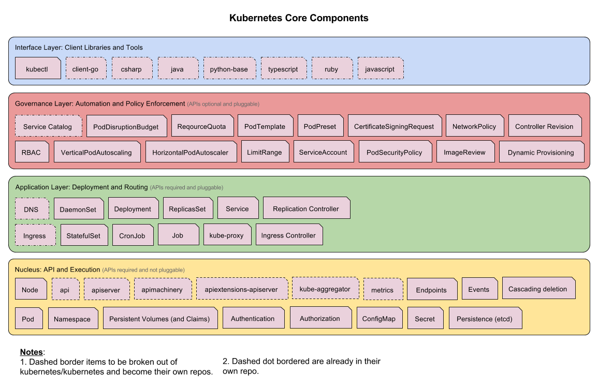

# 分层架构

Kubernetes 的设计理念类似 **Linux 的分层架构**：**越靠下越基础/核心，越往上/外越靠近用户与生态；下层提供能力，上层构建于其上并调用下层**——从而保持核心精简、生态可扩展。



从上到下（核心层在最底、生态系统在最顶）：

```text
┌─────────────────────────────┐
│  生态系统    （顶 / 最外层）    │  日志/监控/CI/CD…(外) + CRI/CNI/CVI…(内)
├─────────────────────────────┤
│  接口层                       │  kubectl、客户端 SDK、集群联邦
├─────────────────────────────┤
│  管理层                       │  度量、自动化、策略(RBAC/Quota/NetworkPolicy)
├─────────────────────────────┤
│  应用层                       │  部署(无/有状态…) + 路由(服务发现/DNS)
├─────────────────────────────┤
│  核心层      （底 / 最核心）    │  对外提供 API、对内提供插件式执行环境
└─────────────────────────────┘
```

下面按**自底向上**(核心 → 生态)逐层说明。

## 五层

1. **核心层（Core）**：K8s 最核心的功能。对外提供 API 以构建高层应用，对内提供**插件式应用执行环境**。
2. **应用层（Application）**：
   - 部署：无状态应用、有状态应用、批处理任务、集群应用等；
   - 路由：服务发现、DNS 解析等。
3. **管理层（Governance）**：
   - 系统度量（基础设施、容器、网络的指标）；
   - 自动化（自动扩展、动态 Provision 等）；
   - 策略管理（RBAC、Quota、PSP、NetworkPolicy 等）。
4. **接口层（Interface）**：[[entities/kubectl]] 命令行、客户端 SDK、集群联邦。
5. **生态系统（Ecosystem）**：接口层之上庞大的容器集群管理调度生态，分两个范畴：
   - **K8s 外部**：日志、监控、配置管理、CI、CD、Workflow、FaaS、OTS 应用、ChatOps 等；
   - **K8s 内部**：CRI、CNI、CVI、镜像仓库、Cloud Provider、集群自身配置与管理等。

## 依赖方向：别和"接口/实现"混

分层架构讲的是**"谁构建在谁之上"**：下层提供基础能力，**上层使用下层**（像 Linux 内核在底、应用在上）。**不是**"上层定义接口、下层实现"。后者是另一套**接口/实现（插件）模型**，两者是不同维度：

| | 分层架构（本页） | 接口/实现（插件）模型 |
| --- | --- | --- |
| 讲的是 | 谁**构建在**谁之上 | 谁**定义**接口、谁**实现** |
| 方向 | 下层提供能力，**上层使用下层** | K8s 核心**定义**接口，外部插件**实现** |
| 例子 | 核心层 → 应用层 → … → 生态系统 | **CRI/CNI/CSI**：kubelet 调用、runtime 实现 |

> 有意思的是两者在 K8s 里并存：CRI/CNI/CVI 这些"接口/实现"的扩展点，正好被归在分层架构**最顶"生态系统"层的内部范畴**里。详见 [[concepts/插件机制与可扩展性]]。

**注意**：这张图是按**功能高度**做的概念分组，不是 OSI 那样"每层只能调用紧邻下层"的刚性调用栈——抓住"越核心越靠下、上层建在下层之上"即可。

## 两种视图：概念分层 vs 运行时拓扑

分层图**不描述运行时谁调谁**。真实的运行时通信是**围着 apiserver 的星型**——所有客户端与组件都直连 apiserver（[[entities/kubectl]]/SDK、controller-manager、scheduler、[[entities/kubelet]] 都是 apiserver 的客户端），各层的资源都是 apiserver 上的 API 对象，经这一个入口操作；只有 apiserver 直接访问 [[entities/etcd]]。

**① 概念分层视图（本页上方那张）** —— 回答"功能分几类、谁建在谁之上"：

```text
生态系统  →  接口层  →  管理层  →  应用层  →  核心层
（最外/顶）                              （最核心/底）
        上层建立在下层之上（概念上的依赖）
```

**② 运行时拓扑视图（星型，apiserver 为枢纽）** —— 回答"组件运行时怎么通信"：

```text
  kubectl/SDK   controller-manager   scheduler   kubelet
        \              \              /           /
         \              \            /           /
          └──────────►  apiserver  ◄───────────┘
                            │  （唯一直接访问）
                            ▼
                          etcd
```

| | 概念分层视图 | 运行时拓扑视图 |
| --- | --- | --- |
| 回答 | 功能分几类、谁建在谁之上 | 组件运行时谁跟谁通信 |
| 形状 | 自底向上的层 | 围着 apiserver 的星型 |
| 适合 | 归类、建立心智地图、理解 core/生态边界与设计哲学 | 理解数据流、排查问题、性能分析 |

> 两者**正交互补**：不是谁取代谁，而是同一系统的两个角度。论"运行时怎么转"星型更真实（详见 [[concepts/控制平面与控制循环]]）；论"功能怎么归类、核心 vs 生态"分层图更清楚。分层图的主要缺点是**长得像调用栈、易被误读**——它没画出 apiserver 这个真正的枢纽。

## 与其它概念的呼应

- **核心精简 + 插件扩展**正是 [[concepts/插件机制与可扩展性]] 的体现（生态系统内部的 CRI/CNI/CVI 即可插拔接口）。
- **核心层对外提供统一 API**对应 [[concepts/控制平面与控制循环]] 里 apiserver 作为唯一入口。
- 这种分层让 K8s "不是封闭 PaaS、而是构建生态的平台"（见 [[entities/Kubernetes]]）。

> 社区相关：Kubernetes architectural roadmap（sig-architecture）。
