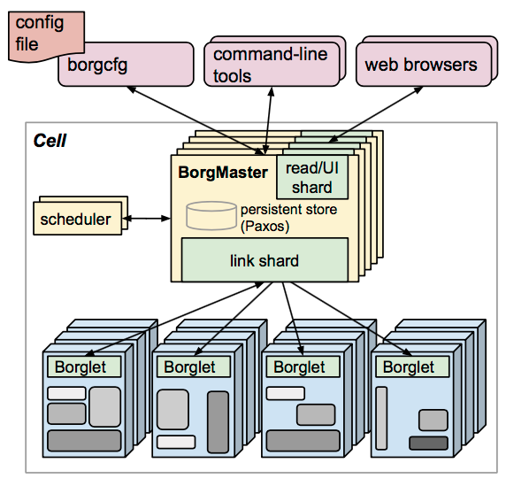

# Borg

Borg 是**谷歌内部的大规模集群管理系统**，负责调度和管理谷歌众多核心服务。它是 [[entities/Kubernetes]] 的**前身与设计灵感来源**——K8s 正是 Borg 多年经验的开源化体现。

## 目标

让用户**不必操心资源管理**、专注于自身核心业务，并做到**跨多个数据中心的资源利用率最大化**。这一理念被 K8s 继承（消除编排基础设施的负担）。

## 组成

- **BorgMaster** —— 整个集群的大脑，维护集群状态并将数据持久化到 **Paxos** 存储。
- **Scheduler** —— 根据应用特点将任务调度到具体机器。
- **Borglet** —— 在容器中真正运行任务。
- **borgcfg** —— 命令行工具，一般通过配置文件向 Borg 提交任务。

## 对 Kubernetes 的影响

K8s 借鉴了 Borg 的诸多设计：**Pod、Service、Labels、单 Pod 单 IP**（见 [[concepts/Pod网络模型]]），整体架构也与 Borg 高度相似。组件可大致对应：

| Borg | Kubernetes |
| --- | --- |
| BorgMaster + Paxos | kube-apiserver / controller-manager + [[entities/etcd]] |
| Scheduler | kube-scheduler |
| Borglet | kubelet + container runtime |
| borgcfg | [[entities/kubectl]] |

> 这条对应关系解释了为什么 K8s 控制平面是现在这个样子——它本质是 Borg 架构的开源再现。详见 [[concepts/控制平面与控制循环]]。

## 参考

- 源摘要：[[sources/kubernetes架构原理]]
